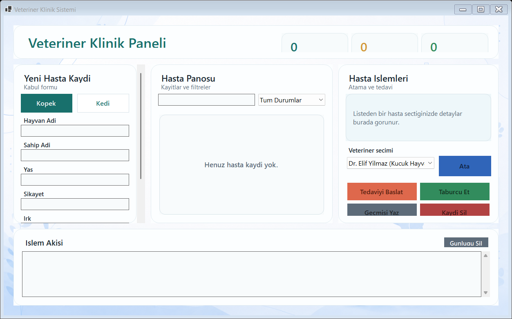

# Veteriner Klinik Sistemi

Windows Forms ile gelistirilmis modern bir veteriner klinik takip uygulamasi. Uygulama; kedi ve kopek hastalarinin kaydini tutar, hastaya veteriner atar, tedavi surecini baslatir, taburcu islemini yapar ve tedavi gecmisini islem akisi uzerinden takip eder.



## Ozellikler

- Modern tek ekranli klinik paneli
- Arka plan gorselli ve kart tabanli arayuz
- Yeni hasta kaydi: hayvan adi, sahip adi, yas, sikayet ve ture ozel bilgi
- Kopek icin irk, kedi icin tuy tipi girisi
- Hasta listesinde kart gorunumu
- Hasta, sahip, sikayet veya veteriner adina gore arama
- Duruma gore filtreleme: kayitli, muayenede, tedavi edildi
- Hazir veteriner listesinden atama
- Tedaviyi baslatma ve taburcu etme akisi
- Tedavi gecmisini islem gunlugune yazdirma
- Hasta kaydi silme ve gunluk temizleme
- Ust panelde toplam hasta, muayenede ve taburcu sayilari
- Kucuk pencere yuksekliklerinde kaydirilabilir kayit paneli

## Kullanilan Teknolojiler

- C#
- .NET 8
- Windows Forms
- Nesne yonelimli programlama

## OOP Tasarimi

Projede ortak hasta bilgileri ve tedavi sozlesmesi `Hayvan` soyut sinifinda toplanir. `Kedi` ve `Kopek` siniflari bu siniftan tureyerek kendi tedavi davranislarini uretir. `ITedaviEdilebilir` arayuzu tedavi operasyonunu tanimlar. `Veteriner` ve `TedaviKaydi` siniflari ise atama ve tedavi gecmisi sorumluluklarini ayirir.

## Proje Yapisi

```text
VeterinerSistemi/
|-- Assets/
|   `-- clinic-background.png       # Form arka plan gorseli
|-- docs/
|   |-- PROJECT_PLAN.md             # Tasarim ve gelistirme plani
|   `-- app-preview.png             # README ekran goruntusu
|-- Form1.cs                        # Ana Windows Forms arayuzu ve ekran akisi
|-- Form1.Designer.cs               # Form pencere ayarlari
|-- Program.cs                      # Uygulama baslangic noktasi
|-- Hayvan.cs                       # Soyut hasta sinifi ve hasta durumu enum'u
|-- Kedi.cs                         # Kediye ozel tedavi davranisi
|-- Kopek.cs                        # Kopege ozel tedavi davranisi
|-- Veteriner.cs                    # Veteriner modeli
|-- TedaviKaydi.cs                  # Tedavi gecmisi modeli
|-- ITedaviEdilebilir.cs            # Tedavi arayuzu
|-- VeterinerSistemi.csproj         # .NET proje dosyasi
`-- VeterinerSistemi.sln            # Visual Studio cozum dosyasi
```

## Calistirma

Bu proje Windows Forms kullandigi icin Windows uzerinde calistirilmalidir.

```powershell
dotnet restore
dotnet build
dotnet run --project VeterinerSistemi.csproj
```

## Kullanim Akisi

1. Hasta turunu secin.
2. Hasta ve sahip bilgilerini girip hastayi kaydedin.
3. Hasta panosundan hastayi secin.
4. Veteriner atayin.
5. Tedaviyi baslatin.
6. Tedaviyi bitirerek hastayi taburcu edin.
7. Gerektiginde tedavi gecmisini islem akisi alaninda goruntuleyin.

## Gelistirme Notlari

Detayli tasarim, sinif diyagrami, ekran akisi ve gelistirme yol haritasi icin [docs/PROJECT_PLAN.md](docs/PROJECT_PLAN.md) dosyasina bakabilirsiniz.
