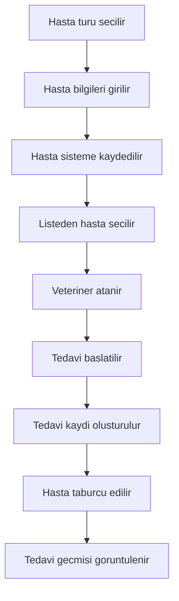
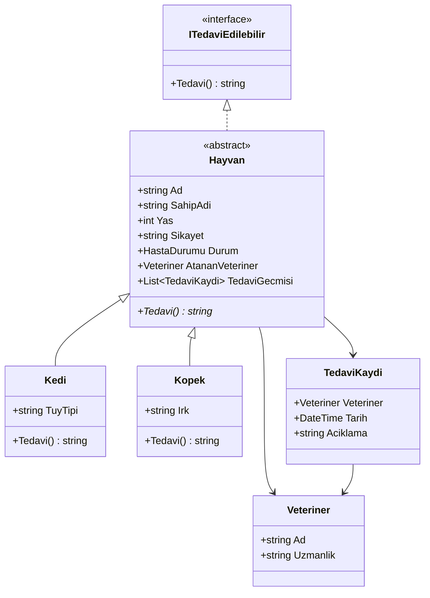

# Proje Tasarimi ve Gelistirme Plani

## 1. Proje Amaci

Veteriner Klinik Sistemi, kucuk bir klinikte hasta kabul ve tedavi surecini modellemek icin hazirlanmistir. Projenin ana hedefi, Windows Forms arayuzu uzerinden nesne yonelimli programlama kavramlarini sade ve anlasilir bir senaryoda gostermektir.

## 2. Kapsam

- Kedi ve kopek hastalarinin kaydedilmesi
- Hasta sahibinin ve sikayet bilgisinin tutulmasi
- Hastaya veteriner atanmasi
- Ture gore farkli tedavi metni uretilmesi
- Tedavi gecmisinin kayit altina alinmasi
- Tek ekranda takip edilebilir klinik akisi

## 3. Kullanici Akisi

## 4. Sinif Tasarimi

## 5. Arayuz Tasarimi

Arayuz tek pencere olarak planlandi. Boylece kullanici hasta kaydi, hasta secimi ve tedavi islemlerini ekran degistirmeden tamamlayabilir.

- Ust alan: uygulama basligi ve hasta ozeti
- Sol alan: yeni hasta kaydi
- Sag ust alan: hasta listesi
- Sag alt alan: veteriner atama ve tedavi islemleri
- Alt alan: islem gunlugu ve tedavi gecmisi

Renkler klinik hissi vermek icin yesil, turkuaz ve sicak vurgu tonu etrafinda secildi. Butonlar surec sirasini belli edecek sekilde ayrildi: kayit ve tamamlama yesil, atama mavi, tedavi baslatma vurgu rengidir.

## 6. Gelistirme Plani

### Tamamlananlar

- Temel Windows Forms projesi kuruldu.
- `Hayvan`, `Kedi`, `Kopek`, `Veteriner` ve `TedaviKaydi` modelleri olusturuldu.
- Polimorfik `Tedavi()` davranisi eklendi.
- Hasta kaydi, veteriner atama, tedavi baslatma ve taburcu etme akisi hazirlandi.
- Arayuz daha okunakli tek ekranli klinik paneli olacak sekilde duzenlendi.
- README, proje plani ve git ignore dosyasi eklendi.

### Sonraki Iyilestirmeler

- Hasta silme ve hasta bilgisi guncelleme ozelligi
- Hasta listesini ada veya duruma gore filtreleme
- Tedavi kayitlarini dosyaya veya veritabanina kaydetme
- Daha fazla hayvan turu ekleme
- Birim testleriyle model davranislarini dogrulama

## 7. Degerlendirme Kriterleri

- OOP kavramlari net gorunmeli: soyut sinif, kalitim, arayuz ve polimorfizm.
- Kullanici akisi basit ve sirali olmali.
- Kod dosyalari sorumluluklarina gore ayrilmali.
- GitHub deposunda README ve proje plani okunakli olmali.
- Derleme hatasiz tamamlanmali.

